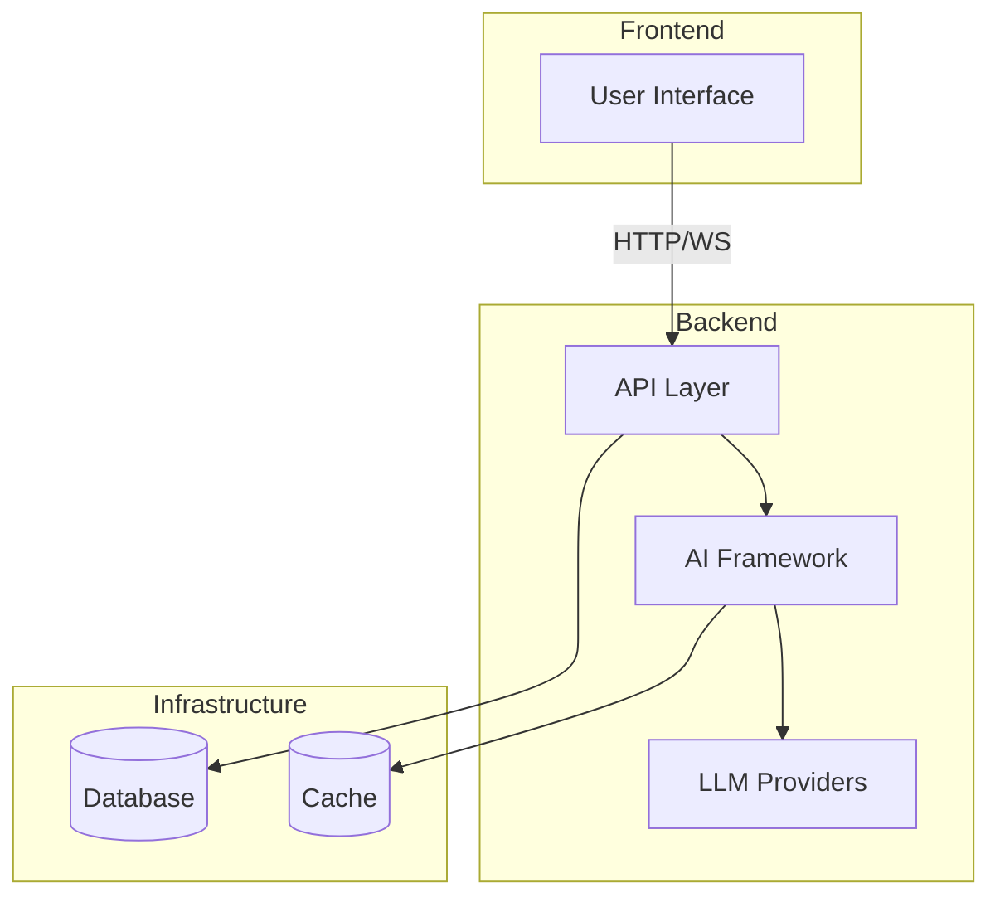

# AI-SDK-VERCEL-AI

[](https://github.com/mk-knight23/AI-SDK-ECOSYSTEM)
[](https://sdk.vercel.ai/)
[](https://nextjs.org/)

> **Framework**: Vercel AI SDK (Streaming Generative UI)
> **Stack**: Next.js 15 RSC + Vercel AI SDK

---

## 🎯 Project Overview

**AI-SDK-VERCEL-AI** demonstrates streaming generative UI where AI renders live React components instead of JSON. It showcases the Vercel AI SDK's unified interface for Anthropic, OpenAI, and Google Gemini with real-time streaming and visual responses.

### Key Features

- 🎨 **Generative UI** - AI renders React components directly
- 📊 **Live Charts** - Streaming data visualization with Recharts
- 🔄 **Multi-Provider** - Unified interface for 10+ LLM providers
- ⚡ **Real-time Streaming** - Instant token-by-token responses
- 🎯 **Type Safety** - Full TypeScript with Zod validation

---

## 🛠 Tech Stack

| Technology | Purpose |
|-------------|---------|
| Next.js 15 RSC | React framework |
| Vercel AI SDK | AI integration |
| Recharts | Data visualization |
| Drizzle ORM | Database |
| Neon DB | Serverless Postgres |
| Radix UI | Components |

---

## 🚀 Quick Start

```bash
npm install
npm run dev
```

---

## 🔌 API Integrations

| Provider | Usage |
|----------|-------|
| Anthropic | Claude (primary) |
| OpenAI | GPT-4o |
| Google Gemini | Gemini Pro |
| All via Vercel AI Gateway |

---

## 📦 Deployment

**Vercel** (native)

```bash
vercel deploy
```

---

## 📁 Project Structure

```
AI-SDK-VERCEL-AI/
├── app/              # Next.js app directory
│   ├── api/         # API routes
│   └── components/  # React components
└── README.md
```

---

## 📝 License

MIT License - see [LICENSE](LICENSE) for details.

---


---

## 🏗️ Architecture



---

## 📡 API Endpoints

| Method | Endpoint | Description |
|--------|----------|-------------|
| GET | /health | Health check |
| POST | /api/execute | Execute agent workflow |
| WS | /api/stream | WebSocket streaming |

---

## 🔧 Troubleshooting

### Common Issues

**Connection refused**
- Ensure backend is running
- Check port availability

**Authentication failures**
- Verify API keys in `.env`
- Check environment variables

**Rate limiting**
- Implement exponential backoff
- Reduce request frequency

---

## 📚 Additional Documentation

- [API Reference](docs/API.md) - Complete API documentation
- [Deployment Guide](docs/DEPLOYMENT.md) - Platform-specific deployment
- [Testing Guide](docs/TESTING.md) - Testing strategies and coverage
---


**Part of the [AI-SDK Ecosystem](https://github.com/mk-knight23/AI-SDK-ECOSYSTEM)**
